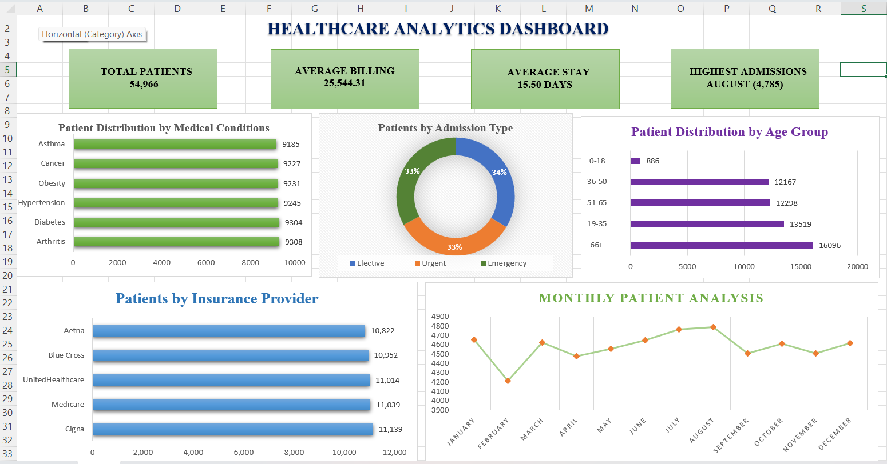

# Healthcare Analytics
# Dashboard Preview


## Project Overview

Healthcare Analytics is a data analysis project focused on understanding
patient demographics, medical conditions, hospital admissions, billing,
insurance coverage, medications, and test results.

The project uses Python for EDA and feature engineering, SQL for analytical
queries, and Excel for dashboard development.

## Tools & Technologies

- Python
- Pandas
- Jupyter Notebook
- MySQL
- SQL
- Microsoft Excel

## Dataset

The dataset contains healthcare records including patient demographics,
medical conditions, admission details, billing information, insurance
providers, medications, and test results.

## Project Workflow

1. Data loading
2. Data quality checks
3. Exploratory Data Analysis
4. Data cleaning
5. Feature engineering
6. SQL analysis
7. Excel dashboard development

## Python Analysis

Python was used for:

- Dataset exploration
- Data quality checks
- Duplicate handling
- Date conversion
- Length of stay calculation
- Age group segmentation
- Validation
- Exporting the cleaned dataset

## SQL Analysis

SQL was used to analyze:

- Patient volume
- Medical conditions
- Admission types
- Age groups
- Insurance providers
- Abnormal test-result rates
- Hospital-level performance
- Medication patterns
- Year-over-year admission trends
- Patient percentage by insurance provider
- Billing and length-of-stay patterns

SQL techniques used include:

- GROUP BY
- HAVING
- CASE
- Subqueries
- CTEs
- Window functions
- RANK()
- LAG()

## Excel Dashboard

The Excel dashboard includes:

- KPI cards
- Patient distribution by medical condition
- Patients by admission type
- Patient distribution by age group
- Patients by insurance provider
- Monthly patient admissions

## Key Insights

- Patient volume is distributed across multiple medical conditions.
- Admission volumes vary across elective, urgent, and emergency cases.
- Older age groups represent a significant share of patients.
- Insurance providers have relatively similar patient coverage.
- Monthly admissions show variation throughout the year.

## Project Structure

```text
HealthcareProject/
├── data/
├── python/
├── sql/
├── dashboard/
├── screenshots/
├── README.md
└── .gitignore
